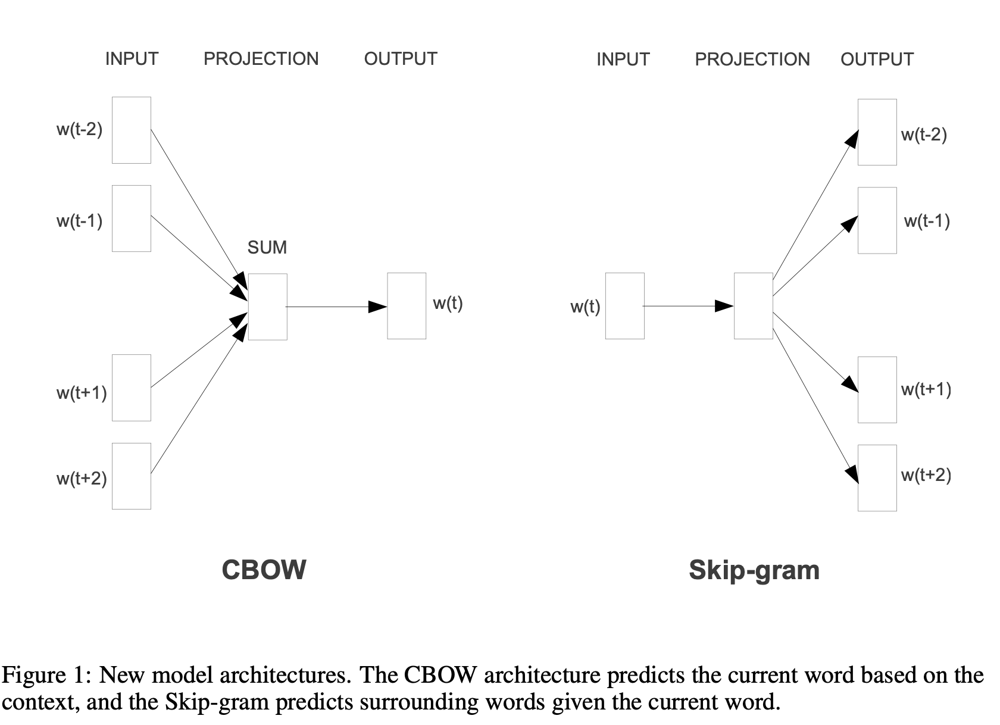

# Efficient representation of Word Representations in Vector Space

Firstly outlines the fact that at this time there was only `atomic` representation for words. Simple models trained on large datasets were outperforming complex models trained on less data. An example is the `N-gram model`. However it is now possible to train more complex algorithms and we might get better results, they give the example of `Neural network based languages` outperforming the `N-gram model`. 

The aim is to propose technique that can be use of high quality representation of words. Dimensionality should be around `50-100`. 

It was found that similarity of word representations goes `beyond simple syntactic regularities`. Using a word offset technique where simple algebraic operations are performed on the word vectors, it was shown for example that **vector(”King”) - vector(”Man”) + vector(”Woman”)** results in a vector that is closest to the vector representation of the word **Queen**.

**The goal of the paper is to try to maximize accuracy of these vector operations by developing new model
architectures that preserve the linear regularities among words.**

## Training 

They use a parallel training method train several models. The framework `DistBelief` allowed them to run several model and synchronize their gradient updates. They also use `Adagrad` for adaptive learning rate. 

### Continuous bag of Words model `(CBOW)`

Similar to a feed-forward NNLM (a feedforward NN with a linear projection layer and a non-linear hidden layer), but non-linear layer is removed and projection is shared for all words. Best performance obtained by building a log-linear classifier with `four future` and `four history words` at the input, where the **training criterion is to correctly classify the current (middle) word**. In the BOW model, the text is represented by counting the occurrence of words, ignoring grammar and order. What makes CBOW 'continuous' is that the embeddings are continuous-valued vectors in a lower-dimensional space, compared to the sparse, high-dimensional vectors produced by a traditional BOW model. Think about 'banc de poisson' and remember `Context/Target`

### Continuous Skip-gram model `Skip-Gram`

The second architecture is similar to CBOW, but instead of predicting the current word based on the
context, it tries to maximize classification of a word based on another word in the same sentence. `Target/Context`. **Better for rare words but takes much more time to train.**

## Results

Word similarity is computed using `cosine` in Vector space. **(This was a question during my BearingPoint Technical interview)**. They want to be able to measure how a word is similar to 'big' as 'bigger' is similar to it and have the same result when measuring how 'smaller' is similar to 'small'. They use algebraic operations on vector to do so. They want to capture `semantic & syntactic relations`. 

